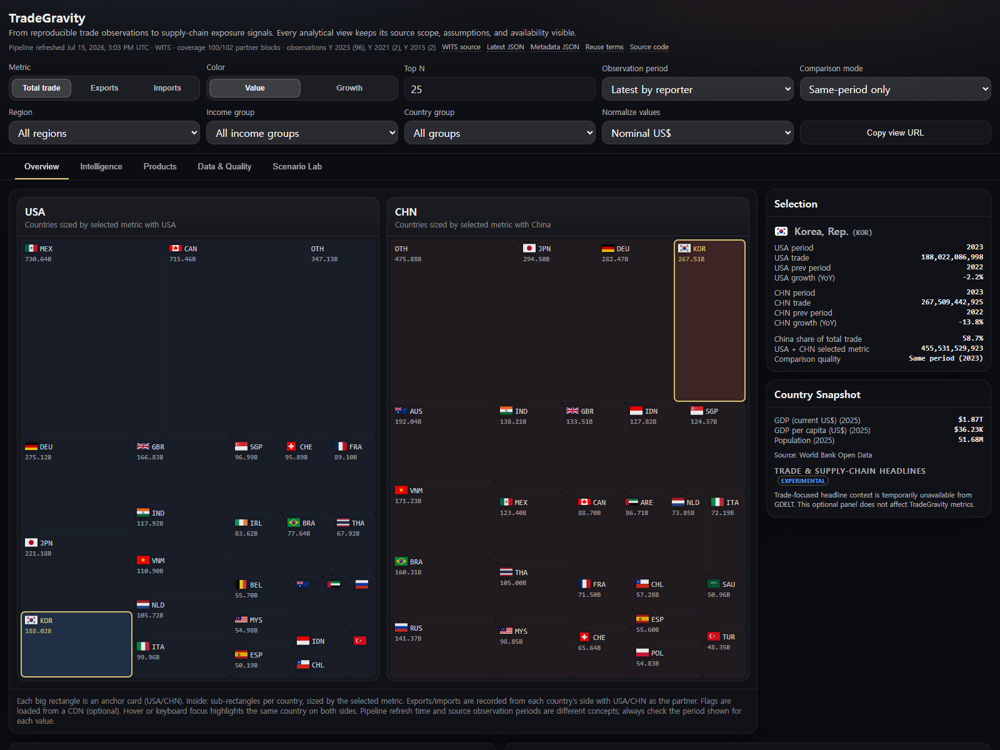
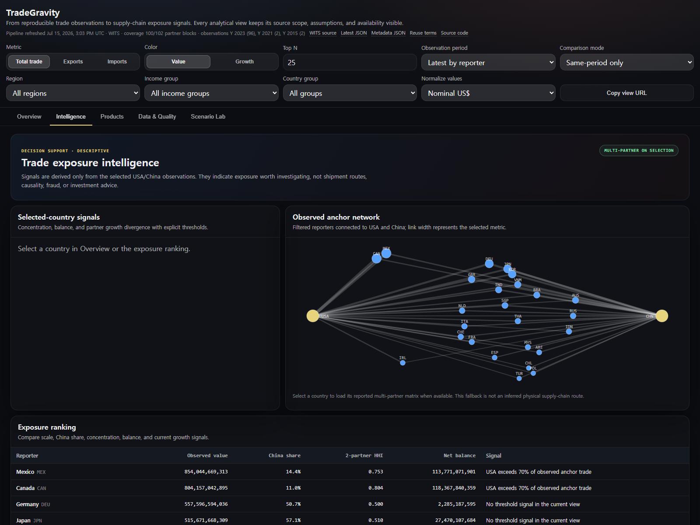

# TradeGravity

[](https://github.com/elecpapaya/TradeGravity/actions/workflows/quality.yml)
[](https://github.com/elecpapaya/TradeGravity/actions/workflows/update-tradegravity.yml)
[](https://github.com/elecpapaya/TradeGravity/actions/workflows/update-semiconductor.yml)
[](https://github.com/elecpapaya/TradeGravity/actions/workflows/codeql.yml)
[](LICENSE)
[](https://github.com/elecpapaya/TradeGravity/issues/3)

TradeGravity is an open-source pipeline and static intelligence dashboard for understanding how economies and strategic supply chains sit—and move—between the United States and China. It does not try to be a neutral catalogue of every global trade fact: the observations remain reported and unadjusted, while the analytical lens is deliberately explicit. Same-period US/China comparisons, annual and focused monthly product flows, mirror-reporting checks, policy context, and transparent sensitivity calculations are published without an application server or a paid data dependency.

- **Live demo:** https://elecpapaya.github.io/TradeGravity/
- **System design:** [DESIGN.md](DESIGN.md)
- **Published data schema:** [docs/DATA_SCHEMA.md](docs/DATA_SCHEMA.md)
- **Reviewed distribution workflow:** [docs/DISTRIBUTION.md](docs/DISTRIBUTION.md)
- **Email consent and suppression preflight:** [docs/EMAIL_DELIVERY_PREFLIGHT.md](docs/EMAIL_DELIVERY_PREFLIGHT.md)
- **Provider-backed email pilot:** [docs/EMAIL_PROVIDER_PILOT.md](docs/EMAIL_PROVIDER_PILOT.md)
- **Private registry and unsubscribe service:** [docs/UNSUBSCRIBE_SERVICE.md](docs/UNSUBSCRIBE_SERVICE.md)
- **Instagram manual-publish preflight:** [docs/INSTAGRAM_PREFLIGHT.md](docs/INSTAGRAM_PREFLIGHT.md)
- **Semiconductor atlas methodology:** [docs/SEMICONDUCTOR_ATLAS.md](docs/SEMICONDUCTOR_ATLAS.md)
- **Reuse examples:** [docs/USAGE.md](docs/USAGE.md)
- **Data rights and attribution:** [docs/DATA_RIGHTS.md](docs/DATA_RIGHTS.md)
- **Project roadmap:** [ROADMAP.md](ROADMAP.md)
- **Iteration evidence and decisions:** [docs/ITERATION_LOG.md](docs/ITERATION_LOG.md)
- **How to cite:** [CITATION.cff](CITATION.cff)

## Dashboard screenshots

| Overview | Intelligence |
| --- | --- |
| [](https://elecpapaya.github.io/TradeGravity/?country=KOR) | [](https://elecpapaya.github.io/TradeGravity/?tab=intelligence) |
| Compare same-period country scale, growth, and selected-country evidence. | Inspect descriptive exposure signals and reported partner networks without treating links as physical shipment routes. |

## Try it in 30 seconds

1. Open the [ready-made ASEAN · Viet Nam · 2023 view](https://elecpapaya.github.io/TradeGravity/?period=Y%3A2023&group=ASEAN&country=VNM&tab=intelligence). The URL restores the period, group, country, and tab.
2. Read **Selected-country signals**, then inspect the partner network. Its links are reported bilateral trade totals—not ports, firms, shipment paths, or proof of rerouting.
3. Open **Products** for the HS2 mix and **Data & Quality** for provider, period, coverage, and warnings. Use **Copy view URL** or an export to retain the evidence behind an observation.

## Why this project exists

Public trade data is valuable but often difficult to turn into a strategic answer. Source APIs use different response shapes, countries can have different latest reporting periods, and a raw global table does not answer whether a connector economy is leaning toward US demand, China demand, or both—and whether that position is changing.

TradeGravity therefore applies one consistent question to public evidence: **where is the selected country, product, or semiconductor stage positioned between the USA and China, and in which direction is it moving?** The code, formulas, transformation rules, source register, deployment workflow, and generated-data schema are public so that researchers, students, and developers can inspect, challenge, or adapt the perspective.

The governing principle is **neutral reported observations, explicit US–China lens**. A positive or negative position is not a political-alignment score, and TradeGravity never changes source values to fit the lens.

## Project status

TradeGravity is an early-stage project under active maintenance. Two staggered GitHub Actions workflows refresh the public dataset every week: the core workflow collects and validates headline, HS2, matrix, and tariff data; the semiconductor workflow restores that state after the public Comtrade quota window, adds bounded annual and monthly chip observations, validates the complete publication, and deploys it. The default headline allowlist tracks 52 reporter economies; a publication can contain fewer when a provider has no usable observation for an allowlisted reporter. Coverage can be changed through configuration.

**Help test v0.1.1:** we are recruiting three students, researchers, or developers for a 15-minute, task-based evaluation. No setup or trade-data expertise is required. Start with [the public study tracker](https://github.com/elecpapaya/TradeGravity/issues/3) or reuse the [recruitment invitation](docs/USER_RECRUITMENT.md), then submit only nonidentifying feedback through the linked form. Participation is voluntary, and public feedback is recorded only with consent.

The viewer is intended for exploration and education, not financial, legal, or policy advice. Its default comparison mode includes only reporters whose USA and China values use the same observation period. Users can opt into all available values, where mixed or stale periods remain visibly flagged.

The pipeline refresh timestamp indicates when TradeGravity generated the site; it does not imply that every source observation is from that date or year. The viewer and `meta.json` expose provider, coverage, and observation-period counts explicitly.

## Features

- WITS SDMX ingestion with automatic latest-year selection.
- Ten-year WITS history collection and published country time series.
- UN Comtrade HS2 product chapters, with public-preview and authenticated modes.
- Curated strategic HS6 trade partitions and revision-aware WITS/TRAINS MFN tariff schedules.
- A US–China Chip Supply Chain Lens with an eight-stage model, 30 mapped HS6 codes, country-stage positions, focused 12-month turning points, a country-role matrix, dated policy/project context, coverage gates, and transparent disruption sensitivity.
- Reported UN Comtrade multi-partner `TOTAL` matrices, with export/import availability kept separate.
- SQLite persistence for repeatable collection and publishing runs.
- Static JSON output for a low-cost, serverless web viewer.
- Linked US/China treemaps with hover highlighting and flag overlays.
- Same-period comparison by default, explicit stale/missing warnings, and a data-quality dashboard.
- Region, income, ASEAN/EU, per-capita, and GDP-share filters.
- Restorable view URLs plus spreadsheet-safe CSV, filtered JSON, PNG analysis snapshots, and Markdown summary reports.
- A first-visit 30-second guide, always-visible metric/period/scope context, and an on-demand definitions and limitations guide.
- Global current/partial/degraded publication status with retry guidance, plus explicit separation of trade-observation, pipeline-refresh, and recent-headline clocks.
- Searchable accessible data table and selected-country 5–10 year trend.
- HS2 product mix for the selected reporter, kept separate from WITS headline totals.
- Shareable Overview, US–China Lens, Chip Lens, Products, Data & Quality, and Scenario Lab tabs with synchronized filters, country, semiconductor stage/context, product, tariff, and scenario-assumption state.
- A semiconductor Pulse that separates latest month-to-month movement from publish-to-publish coverage and value revisions, with a machine-readable bounded change feed.
- A deterministic `briefing.json` distribution draft with three cited semiconductor observations, review-gated email Markdown, and review-gated 4:5 carousel copy. The static site does not collect subscribers, send email, or publish to social platforms.
- An offline `cmd/distributor` build that turns a ready briefing into email HTML/Markdown, a cited Instagram caption, alt text, and six matched 1080×1350 SVG/PNG cards in either `intelligence-dark` or `editorial-light`; all assets share review gates and deterministic hashes without making a network request.
- An aggregate-only `cmd/instagram-preflight` that requires an unchanged Instagram approval, decodes all six PNGs, validates caption evidence/scope/tags and six alt-text sections, refuses output inside the kit, and keeps credentials and automatic publishing explicitly false.
- A fail-closed `cmd/distribution-approval` step that verifies the complete file set and SHA-256 manifest before recording a channel-specific content approval; provider delivery, subscriber consent, and automatic publishing remain explicitly false.
- A local `cmd/distribution-preflight` gate that validates private double-opt-in and suppression CSVs, approved-audience identity, and unique opaque HTTPS unsubscribe URLs, enforces a pilot ceiling, and writes only aggregate counts and digests—never recipient addresses or tokens—while keeping provider configuration and delivery authorization false.
- A separate SQLite `cmd/subscription-registry` and bounded `cmd/unsubscribe-service` that can collect double-opt-in consent outside the static dashboard, send short-lived Resend confirmations, activate only on explicit confirmation POST, issue HMAC-authenticated links without email/audience claims, keep link-scanner GETs read-only, record idempotent RFC one-click suppressions, verify signed Resend feedback, and export private preflight inputs.
- A fail-closed Resend pilot path that binds a one-hour launch approval to the exact aggregate preflight, sender, audience, and content/input digests; reruns the consent and suppression checks immediately before delivery; adds visible and header one-click unsubscribe links; isolates every recipient in a separate provider request; and records only HMAC recipient keys in a private SQLite ledger. Accepted or uncertain attempts are never sent again automatically; provider-confirmed non-acceptance still requires a recorded reconciliation and a new launch approval.
- Two-anchor position metrics whose formulas are visible: USA share, China share, exposure balance, position shift, dual exposure, and anchor-growth divergence.
- Unadjusted bilateral mirror-reporting diagnostics that compare both countries' reports without choosing either as ground truth or treating the difference as fraud, evasion, rerouting, or an adjusted estimate.
- An illustrative HS6 tariff sensitivity lab that can load a published MFN rate and product import baseline while exposing elasticity, pass-through, fallback, and source assumptions.
- A machine-readable `catalog.json` that separates ready, partial, and planned resources. Strategic HS6, focused monthly semiconductor signals, tariffs, bilateral matrices, and mirror diagnostics are published; computed value-added and versioned scenario outputs remain planned.
- Build-time evidence-grounded explanations with citation validation and deterministic fallback.
- Year-over-year growth coloring when prior-period data is available.
- Optional World Bank indicators and an experimental GDELT trade/supply-chain headline panel with a 14-day window, title relevance checks, deduplication, source-country scope, and visible caveats.
- Reporter allowlist for controlled coverage.
- Weekly, staggered collection and GitHub Pages deployment through GitHub Actions.

## How it works

```text
WITS totals/history --------\
WITS/TRAINS tariffs ---------\
UN Comtrade HS2/HS6/matrix ---> SQLite ---> publisher ---> versioned static JSON
World Bank context ----------/                  |                    |
                                             v                    v
                                  grounded explainer     static web explorer
```

- `cmd/collector` fetches and normalizes observations.
- `internal/store/sqlite` persists observations using an idempotent key.
- `cmd/context` publishes region, income, population, and GDP context.
- `cmd/publisher` calculates latest values, same-period flags, time series, products, quality, totals, shares, and growth.
- `cmd/explainer` builds citation-checked explanations; it never sends an API key to the browser.
- `site` renders the generated JSON as a static interactive viewer.

## Data sources and interpretation

| Source | Use |
| --- | --- |
| [World Integrated Trade Solution (WITS)](https://wits.worldbank.org/) | Default bilateral trade observations |
| [WITS/TRAINS](https://wits.worldbank.org/WITS/WITS/Support%20Materials/Training/GTAP_UNCTAD_Tariff_Data.asp) | Product-level tariff schedules |
| [UN Comtrade](https://comtradeplus.un.org/) | HS2/strategic HS6 trade and reported multi-partner totals |
| [World Bank Open Data](https://data.worldbank.org/) | Optional country indicators in the viewer |
| [GDELT](https://www.gdeltproject.org/) | Optional, experimental trade/supply-chain headline context; keyword-filtered by publisher source country and never used in trade metrics |
| [OECD ICIO](https://www.oecd.org/en/data/datasets/inter-country-input-output-tables.html) | Free industry-level value-added/input-output context; its aggregation and release lag are kept explicit and it is never substituted for HS6 observations |
| NIST, BIS, European Commission, METI, China NDRC/MOFCOM, and other official public pages | Dated semiconductor policy and project context linked from the reference; never substituted for customs observations or operating capacity |
| SEMI public releases | Publicly accessible industry context only; no paid market or proprietary capacity dataset is required for a published TradeGravity metric |

Exports and imports are reported from each reporter country's perspective, with `USA` or `CHN` on the partner side. Trade is calculated as exports plus imports. The publisher retains the period and period type used for each partner block so users can see data freshness.

Source availability, revisions, and classification choices can affect results. TradeGravity does not modify or guarantee the accuracy of upstream data.

### US–China lens formulas

For a selected metric within the two-anchor scope:

```text
USA share        = USA value / (USA value + China value)
China share      = China value / (USA value + China value)
exposure balance = USA share − China share
dual exposure    = 2 × min(USA share, China share)
position shift   = current exposure balance − previous comparable exposure balance
```

Positive balance or shift means toward the USA; negative means toward China. `dual exposure` reaches 100% when the two observed anchor shares are equal and 0% when only one anchor is observed. These are bounded descriptive signals—not whole-world dependency, political alignment, causal impact, or supply-chain route estimates.

## Reusing and citing the data

The public deployment exposes stable machine-readable endpoints:

- `https://elecpapaya.github.io/TradeGravity/data/meta.json`
- `https://elecpapaya.github.io/TradeGravity/data/latest.json`
- `https://elecpapaya.github.io/TradeGravity/data/series.json`
- `https://elecpapaya.github.io/TradeGravity/data/products/index.json`
- `https://elecpapaya.github.io/TradeGravity/data/strategic-hs6/index.json`
- `https://elecpapaya.github.io/TradeGravity/data/semiconductors/reference.json`
- `https://elecpapaya.github.io/TradeGravity/data/semiconductors/monthly/index.json`
- `https://elecpapaya.github.io/TradeGravity/data/changes.json`
- `https://elecpapaya.github.io/TradeGravity/data/briefing.json`
- `https://elecpapaya.github.io/TradeGravity/data/tariffs/index.json`
- `https://elecpapaya.github.io/TradeGravity/data/bilateral-matrix/index.json`
- `https://elecpapaya.github.io/TradeGravity/data/mirror/index.json`
- `https://elecpapaya.github.io/TradeGravity/data/quality.json`
- `https://elecpapaya.github.io/TradeGravity/data/catalog.json`
- `https://elecpapaya.github.io/TradeGravity/data/explanations/index.json`

`latest.json` is the canonical published dataset. The viewer's **Download CSV** button creates a spreadsheet-safe convenience export of the currently filtered reporters, including schema version, provider, pipeline timestamp, observation periods, flows, growth values, totals, and China share. See [docs/DATA_SCHEMA.md](docs/DATA_SCHEMA.md) before comparing reporters with different periods.

When citing a result, record the repository URL, commit or release when applicable, provider, `generated_at` timestamp, and the observation period shown for each value. GitHub can generate citation formats from [CITATION.cff](CITATION.cff).

Apache-2.0 covers the project code and original documentation, not rights in upstream observations or linked news. Review [docs/DATA_RIGHTS.md](docs/DATA_RIGHTS.md) and the selected provider's current terms before redistributing generated data.

## Requirements

- Go 1.25.12+ (includes standard-library security fixes required by CI)
- Internet access to the selected data provider and public front-end CDNs
- Python 3, or another static file server, to preview the viewer locally

## Quick start

```bash
go run ./cmd/context
go run ./cmd/collector run -provider wits -history-years 9
go run ./cmd/collector products -provider comtrade -primary-provider wits -year auto
go run ./cmd/collector strategic -provider comtrade -primary-provider wits -year auto -history-years 4
COMTRADE_FREQUENCY=M go run ./cmd/collector chip-monthly -provider comtrade -months 12
go run ./cmd/collector matrix -provider comtrade -primary-provider wits -year auto
go run ./cmd/collector tariffs -provider trains -year auto -data-type aveestimated
go run ./cmd/publisher build -out site/data -series-years 10
go run ./cmd/explainer -dir site/data
go run ./cmd/validator -dir site/data -min-reporters 40
cd site
python -m http.server 8080
```

Open `http://localhost:8080`.

### Offline sample preview

The production collector requires network access and can take several minutes. For UI or contribution work, copy the validated synthetic sample into the ignored output directory:

```powershell
New-Item -ItemType Directory -Force site/data
Copy-Item examples/sample-data/* site/data/ -Recurse -Force
```

```bash
mkdir -p site/data
cp -R examples/sample-data/. site/data/
```

Then serve `site/` as shown above. The three sample reporters and values are synthetic and are not evidence about real trade.

To run the automated checks:

```bash
go test ./...
go vet ./...
node --test site/security.test.cjs site/data-tools.test.cjs site/explorer-tools.test.cjs site/intelligence-tools.test.cjs site/semiconductor-tools.test.cjs site/experience-tools.test.cjs site/news-tools.test.cjs site/structure.test.cjs
```

## Collector configuration

Example with explicit partners, flows, ten published years, and bounded concurrency:

```bash
go run ./cmd/collector run \
  -partners USA,CHN \
  -flows export,import \
  -allowlist configs/allowlist.csv \
  -history-years 9 \
  -concurrency 6
```

Common flags:

| Flag | Purpose | Default |
| --- | --- | --- |
| `-provider` | `wits` or `comtrade` | `wits` |
| `-partners` | Comma-separated partner ISO3 codes | `USA,CHN` |
| `-flows` | Comma-separated flows | `export,import` |
| `-allowlist` | Reporter allowlist CSV; empty disables filtering | `configs/allowlist.csv` |
| `-history-years` | Prior years to fetch for growth calculation | `1` |
| `-concurrency` | Maximum reporter jobs in flight | `6` |
| `-db` | SQLite output path; empty disables persistence | `tradegravity.db` |

### WITS environment variables

- `WITS_BASE_URL` (default `https://wits.worldbank.org/API/V1/`)
- `WITS_API_KEY` (optional)
- `WITS_TRADE_PATH`
- `WITS_RATE_LIMIT_PER_SEC`

### UN Comtrade environment variables

- `COMTRADE_PRIMARY_KEY` (optional; without it, public preview endpoints are used)
- `COMTRADE_SECONDARY_KEY` (optional fallback)
- `COMTRADE_BASE_URL` (default `https://comtradeapi.un.org/`)
- `COMTRADE_DATA_PATH` (default `data/v1/get/{type}/{freq}/{cl}`)
- `COMTRADE_RATE_LIMIT_PER_SEC` (default `2`)
- `COMTRADE_RATE_LIMIT_BURST` (default `2`)
- `COMTRADE_MAX_RETRIES` (default `3`)
- `COMTRADE_REPORTERS_URL`
- `COMTRADE_PARTNERS_URL`

The focused semiconductor command uses `COMTRADE_FREQUENCY=M`, the 30-code reference, and [`configs/chip_connectors.csv`](configs/chip_connectors.csv). The public preview accepts only one period per request, so the collector requests one month at a time while batching up to six reporters and both anchor partners for each flow. This keeps the latest 12 complete months within the public call and response limits without narrowing the published turning-point window. It is a turning-point layer, not a complete semiconductor market database.

The `matrix` collector omits `partnerCode` to request the partner breakdown. It never treats `partnerCode=0` (World) as a country row. Public preview responses may provide only numeric partner codes; TradeGravity resolves them through the official partner reference and excludes non-alphabetic special aggregates.

### WITS/TRAINS tariff environment variables

- `TRAINS_BASE_URL` (default `https://wits.worldbank.org/API/V1/SDMX/V21/rest/data/DF_WITS_Tariff_TRAINS/`)
- `TRAINS_AVAILABILITY_URL`
- `TRAINS_TIMEOUT_SECONDS` (default `30`)
- `TRAINS_RETRIES` (default `3`)
- `TRAINS_BACKOFF_MILLISECONDS` (default `750`)

The tariff collector resolves WITS numeric reporter and partner codes, selects the latest available tariff year and source nomenclature, and falls back from unavailable AVE-estimated rows to reported rows without relabeling their `data_type`.

Set an optional primary key for the current shell without committing it:

```powershell
$env:COMTRADE_PRIMARY_KEY = "YOUR_KEY"
```

```bash
export COMTRADE_PRIMARY_KEY="YOUR_KEY"
```

This repository reads operating-system environment variables and does not load a `.env` file. For GitHub Actions, store keys as repository secrets named `COMTRADE_PRIMARY_KEY` and, if used, `COMTRADE_SECONDARY_KEY`. Provider transport errors redact request URLs and credentials, but keys should still be rotated immediately if they appear in any external log.

## Generated files and deployment

- Local SQLite database: `tradegravity.db`
- Published JSON: `meta.json`, `catalog.json`, `changes.json`, `briefing.json`, `latest.json`, `series.json`, `quality.json`, `context.json`, `products/`, `strategic-hs6/`, `semiconductors/reference.json`, `semiconductors/monthly/`, `tariffs/`, `bilateral-matrix/`, `mirror/`, and `explanations/` under `site/data/`

Generated data and the local database are intentionally not committed to the default branch. The scheduled or manually dispatched core workflow runs the broad collectors and saves its validated database as a three-day Actions artifact. The staggered semiconductor workflow restores that artifact and the previous `gh-pages` publication, adds annual and monthly chip observations for [`configs/chip_connectors.csv`](configs/chip_connectors.csv), emits a validated publish-to-publish `changes.json`, and deploys `site/` to the `gh-pages` branch. A `main` push uses the latest validated `data/` directory from `gh-pages` and redeploys the site without calling WITS, UN Comtrade, WITS/TRAINS, or World Bank APIs. This keeps code-only deployments fast while the weekly refresh remains the source of new published observations.

The fast deployment intentionally fails if `gh-pages` does not contain `data/latest.json` and `data/meta.json`. Bootstrap or repair the published dataset by manually running **Update TradeGravity core**, then **Update TradeGravity semiconductor**; the second workflow waits out any remaining quota window before it publishes.

Before deployment, `cmd/validator` checks provenance across every artifact, reporter uniqueness, periods, non-negative finite values, totals and shares, matrix availability/count identities, tariff rate identities, product keys, bounded publication-change arithmetic and ordering, briefing arithmetic and mandatory human-review gates, context coverage, and explanation evidence references.

## Maintenance and contributing

TradeGravity is created and primarily maintained by [@elecpapaya](https://github.com/elecpapaya). Maintenance includes monitoring scheduled collection runs, reviewing source/API changes, keeping dependencies current, improving tests and documentation, and planning releases.

Issues and pull requests are welcome. See [CONTRIBUTING.md](CONTRIBUTING.md) for the development workflow and [ROADMAP.md](ROADMAP.md) for planned work. The [user-testing protocol](docs/USER_TESTING.md) explains how nonidentifying feedback is collected and turned into follow-up issues. Please do not include API keys or other secrets in issues, logs, or commits.

Support routes are documented in [SUPPORT.md](SUPPORT.md), and the release procedure is documented in [docs/RELEASING.md](docs/RELEASING.md).

Security vulnerabilities should be reported privately according to [SECURITY.md](SECURITY.md). Notable changes are recorded in [CHANGELOG.md](CHANGELOG.md).

## License

Licensed under the [Apache License 2.0](LICENSE).
